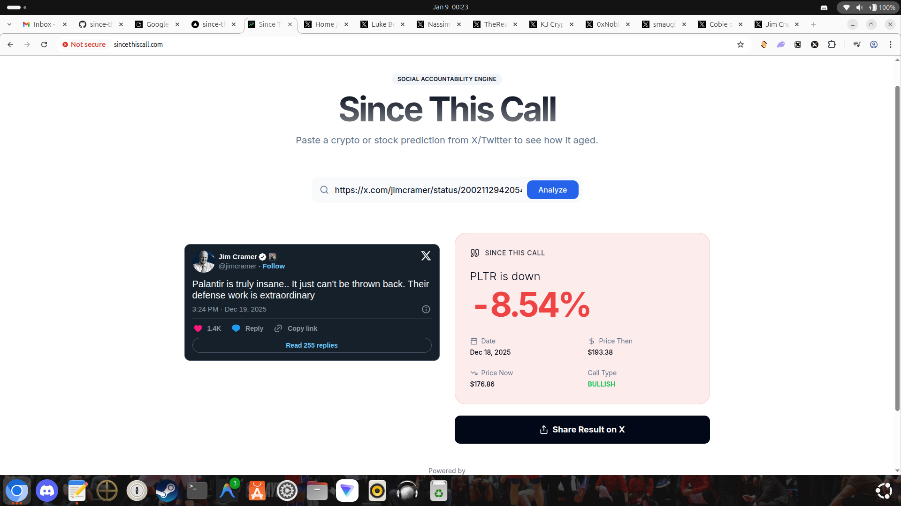

# Since This Call

> [!IMPORTANT]
> **DEVELOPMENT RULE**: Do NOT use Moltbot for any development tasks. Use **Antigravity** and its models strictly.
 📉📈

**Since This Call** is a "Social Prediction Tracker" that tracks the performance of crypto and stock predictions ("calls") made on X (formerly Twitter).

Paste a tweet URL, and the app will tell you exactly how that asset has performed since the moment the tweet was posted.



## ✨ Features

- **Asset Type Selection**: Explicit "Crypto" vs "Stock" search modes for maximum accuracy
- **AI-Powered Extraction**: Uses **Google Gemini 2.0 Flash** to intelligently parse tweets, identifying asset symbols, sentiment (Bullish/Bearish), and prediction dates
- **📊 Stats Dashboard**: Charts and analytics at `/stats` showing platform-wide performance
- **📈 Trending Tickers**: See which assets gurus are calling most (BTC, ETH, SOL, etc.)
- **Live Price Updates**: Automatic price refresh to keep call receipts accurate
- **Multi-Asset Support**:
  - **Crypto**: Real-time prices via **CoinMarketCap** & **CoinGecko** (Authoritative assets only)
  - **Stocks & ETFs**: Free data via **Yahoo Finance**
  - **Index Fallbacks**: Automatically resolves SPX→SPY, NQ→QQQ, DJI→DIA
- **Leaderboard**: Track the top (and worst) financial gurus with win/loss records
- **Profile Pages**: Individual pages for each guru with full prediction history and charts
- **Community Comments**: Disqus integration for discussion on each profile
- **Social Sharing**: One-click visual sharing generates a screenshot of the analysis
- **Premium UI**: Sleek dark-mode design with Tailwind CSS and shadcn/ui

## 🛑 Hard Rules for Contributors/Agents
1. **Push to `main` first**: Commit and push code changes before database actions.
2. **Sync Data**: Always run `npx tsx scripts/sync-to-local.ts` after a push or pull to keep local data in sync with production.
3. **Type Safety**: Never overwrite Redis Hashes (`user:profile`) with Strings. Use `AnalysisStore`.

## 📊 Current Stats (Jan 31, 2026 - Post-Deep Purge)

| Metric | Value |
|--------|-------|
| Total Analyses | ~1,464 |
| Unique Gurus | 562 |
| Platform Win Rate | ~39% |
| Tracked Tickers | 212 |

## 🛠️ Tech Stack

| Layer | Technology |
|-------|------------|
| Framework | [Next.js 14](https://nextjs.org/) (App Router) |
| Language | [TypeScript](https://www.typescriptlang.org/) |
| Database | [Upstash Redis](https://upstash.com/) (Serverless) |
| AI | [Vercel AI SDK](https://sdk.vercel.ai/) + [Google Gemini](https://ai.google.dev/) |
| Styling | [Tailwind CSS](https://tailwindcss.com/) + [shadcn/ui](https://ui.shadcn.com/) |
| Charts | [Recharts](https://recharts.org/) |
| Monitoring | [Vercel Speed Insights](https://vercel.com/docs/speed-insights) |

## 🚀 Getting Started

### Prerequisites
- Node.js 18+
- Google Gemini API Key (Free)
- Upstash Redis account (Free tier available)

### Installation

1. **Clone the repository:**
   ```bash
   git clone https://github.com/hamzacodesfast/since-this-call.git
   cd since-this-call
   ```

2. **Install dependencies:**
   ```bash
   npm install
   ```

3. **Configure Environment:**
   ```bash
   cp .env.example .env.local
   ```
   
   Add your keys to `.env.local`:
   ```env
   # Required
   GOOGLE_GENERATIVE_AI_API_KEY=your_gemini_key
   UPSTASH_REDIS_REST_KV_REST_API_URL=your_upstash_url
   UPSTASH_REDIS_REST_KV_REST_API_TOKEN=your_upstash_token
   ```

4. **Run the Local Redis Proxy:**
   In a separate terminal, run:
   ```bash
   npx tsx scripts/local-redis-proxy.ts
   ```
   *Note: This starts a local Redis server and a proxy that makes it compatible with the Upstash API used in the app.*

5. **Sync Data from Production (Recommended):**
   ```bash
   npx tsx scripts/sync-to-local.ts
   ```

6. **Run the Development Server:**
   ```bash
   npm run dev
   ```

7. **Open the App:**
   Visit `http://localhost:3000`

## 🧰 Admin Scripts

Located in `/scripts`, these help manage and correct data:

| Script | Usage | Purpose |
|--------|-------|---------|
| `reanalyze.ts` | `npx tsx scripts/reanalyze.ts <TWEET_ID>` | Re-analyze a tweet to fix incorrect data |
| `refresh-metrics.ts` | `npx tsx scripts/refresh-metrics.ts` | Manually refresh homepage metrics |
| `remove-tweet.ts` | `npx tsx scripts/remove-tweet.ts <TWEET_ID>` | Remove a single analysis |
| `sync-profile.ts` | `npx tsx scripts/sync-profile.ts <USERNAME>` | Recalculate user stats |
| `backup-data.ts` | `npx tsx scripts/backup-data.ts` | Export all Redis data |

## 📦 Deployment

Optimized for [Vercel](https://vercel.com):

1. Push code to GitHub
2. Import project into Vercel
3. Add environment variables in Vercel Dashboard
4. Deploy!

### Cron Setup
For Vercel Hobby plan (Daily):
```json
{
  "crons": [{
    "path": "/api/cron/refresh",
    "schedule": "0 0 * * *"
  }]
}
```
*Note: For 15-minute updates, upgrade to Pro or use an external cron service.*

## 🛡️ Data Integrity
    
This project uses Upstash Redis and relies on strict data types.
    
- **Profiles (`user:profile:*`)** are **Hashes**. Never use `set` or `setnx` on them.
- **Histories (`user:history:*`)** are **Lists**.
- **Sets (`all_users`)** track membership.
    
**Always use the `src/lib/analysis-store.ts` abstractions.** Do not write raw Redis commands in new features unless strictly necessary and type-verified.

## 📄 License

This project is open-source and available under the [MIT License](LICENSE).

---

Built with ❤️ by [@hamzacodesfast](https://x.com/hamzacodesfast)
