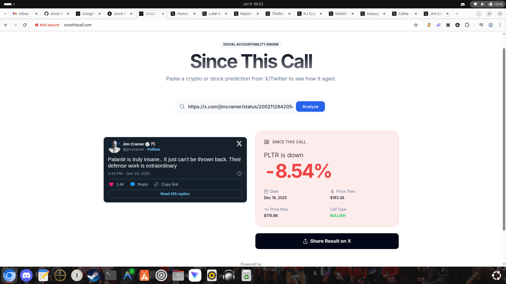

# Since This Call

> [!IMPORTANT]
> **DEVELOPMENT RULE**: Do NOT use Moltbot for any development tasks. Use **Antigravity** and its models strictly.
 📉📈

**Since This Call** is a "Social Prediction Tracker" that tracks the performance of crypto and stock predictions ("calls") made on X (formerly Twitter).

Paste a tweet URL, and the app will tell you exactly how that asset has performed since the moment the tweet was posted.



## ✨ Features

- **Asset Type Selection**: Explicit "Crypto" vs "Stock" search modes for maximum accuracy
- **AI-Powered Extraction**: Uses **Google Gemini 2.0 Flash** to intelligently parse tweets
- **📊 Stats Dashboard**: Charts and analytics at `/stats` showing platform-wide performance
- **📈 Trending Tickers**: See which assets gurus are calling most (BTC, ETH, SOL, etc.)
- **Live Price Updates**: Automatic price refresh to keep call receipts accurate
- **Leaderboard**: Track the top (and worst) financial gurus with win/loss records
- **Profile Pages**: Individual pages for each guru with full prediction history and charts
- **Premium UI**: Sleek dark-mode design with Tailwind CSS and shadcn/ui

## 🛑 Hard Rules for Contributors/Agents
1. **Push to `main` first**: Commit and push code changes before database actions.
2. **Local Sync**: Always run `npx tsx scripts/sync-vps-to-local.ts` to keep your local environment in sync with the live VPS data.
3. **Type Safety**: Never overwrite Redis Hashes (`user:profile`) with Strings. Use `AnalysisStore`.
4. **Maintenance**: Run `npm run watch` locally in `services/twitter-watcher` to capture new calls. It writes directly to the VPS.

## 🛠️ Tech Stack

| Layer | Technology |
|-------|------------|
| Framework | [Next.js 14](https://nextjs.org/) (App Router) |
| Hosting | **Hetzner VPS (Dockerized)** |
| Proxy | **Caddy** (Automatic SSL / Reverse Proxy) |
| Database | **Redis** (Self-hosted on VPS) |
| AI | [Vercel AI SDK](https://sdk.vercel.ai/) + [Google Gemini](https://ai.google.dev/) |
| Styling | [Tailwind CSS](https://tailwindcss.com/) + [shadcn/ui](https://ui.shadcn.com/) |

## 🚀 Getting Started

### Prerequisites
- Node.js 18+
- Docker & Docker Compose (for production)
- Google Gemini API Key

### Installation

1. **Clone the repository:**
   ```bash
   git clone https://github.com/hamzacodesfast/since-this-call.git
   cd since-this-call
   ```

2. **Install dependencies:**
   ```bash
   npm install
   ```

3. **Configure Environment:**
   ```bash
   cp .env.example .env.local
   ```
   *Add your `REDIS_URL` (VPS) and `GOOGLE_GENERATIVE_AI_API_KEY` to `.env.local`.*

4. **Sync Data from VPS:**
   ```bash
   npx tsx scripts/sync-vps-to-local.ts
   ```

5. **Run the Development Server:**
   ```bash
   npm run dev
   ```

## 🧰 Admin & Maintenance Scripts

Located in `/scripts`, optimized with **Redis Pipelining** for remote performance:

| Script | Usage | Purpose |
|--------|-------|---------|
| `sync-vps-to-local.ts` | `npx tsx scripts/sync-vps-to-local.ts` | Mirros live VPS data to local laptop |
| `backup-data.ts` | `npx tsx scripts/backup-data.ts` | Full JSON export of current Redis state |
| `generate-tweets.ts` | `npx tsx scripts/generate-tweets.ts` | Generates daily metrics tweets to `docs/` |
| `refresh-metrics.ts` | `npx tsx scripts/refresh-metrics.ts` | Warms/Refreshes global stats cache |
| `recalculate-all-production.ts` | `npx tsx scripts/recalculate-all-production.ts` | Full profile/WR reconciliation |

## 📦 Deployment (VPS)

The app is deployed via Docker and Caddy for zero-maintenance SSL.

1. **Build and Deploy**:
   ```bash
   docker compose up -d --build
   ```

2. **Caddy Config**:
   Managed via the `Caddyfile` in the root directory.

## 🛡️ Data Integrity
    
- **Profiles (`user:profile:*`)** are **Hashes**. Never use `set` or `setnx` on them.
- **Histories (`user:history:*`)** are **Lists**.
- **Always use `AnalysisStore`**: Abstractions are located in `src/lib/analysis-store.ts`.

---

Built with ❤️ by [@hamzacodesfast](https://x.com/hamzacodesfast)
